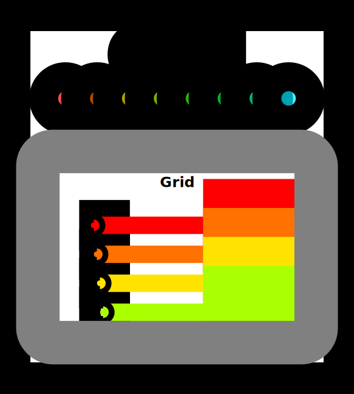

# Metal_Puzzles
From [metal-puzzles](https://github.com/abeleinin/Metal-Puzzles/tree/main) repository. I did the excersices on my own and also added more visualizations and more testcases (and more puzzles!).


```sh
pip install -qqq git+https://github.com/danoneata/chalk@srush-patch-1
pip install mlx
```

```python
import mlx.core as mx
from utils import MetalKernel, MetalProblem
```

## Puzzle 1: Map

Implement a "kernel" (GPU function) that adds 10 to each position of the array `a` and stores it in the array `out`.  You have 1 thread per position.


My solution's output visualization:


## Puzzle 2: Zip 

Implement a kernel that takes two arrays `a` and `b`, adds each element together, and stores the result in the output array `out`. You have 1 thread per position.


My solution's output visualization:


## Puzzle 3: Guard

Implement a kernel that adds 10 to each position of `a` and stores it in `out`. You have more threads than positions.


My solution's output visualization:



## Puzzle 4: Map 2D

Implement a kernel that adds 10 to each position of `a` and stores it in `out`. Input `a` is 2D and square. You have more threads than positions.

**Note:** All memory in Metal is represented as a 1D array, so direct 2D indexing is not supported.


My solution's output visualization:


## Puzzle 5: Broadcast

Implement a kernel that adds `a` and `b` and stores it in `out`. Inputs `a` and `b` are arrays. You have more threads than positions.


My solution's output visualization:


## Puzzle 6: Threadgroups

Implement a kernel that adds 10 to each position of `a` and stores it in `out`. You have fewer threads per threadgroup than the size of `a`, but more threads than positions.


My solution's output visualization:


## Puzzle 7: Threadgroups 2D

Implement the same kernel in 2D. You have fewer threads per threadgroup than the size of `a` in both directions, but more threads than positions in the grid.


My solution's output visualization:


## Puzzle 8: Threadgroup Memory
Implement a kernel that adds 10 to each position of `a` and stores it in `out`. You have fewer threads per threadgroup than the size of `a`.

**Warning**: Each threadgroup can only have a *constant* amount of threadgroup memory that the threads can read and write to. After writing to threadgroup memory, you need to call `threadgroup_barrier(mem_flags::mem_threadgroup)` to ensure that threads are synchronized. In this puzzle we add the `header` variable as a new parameter to the `MetalKernel` object, which simply defines values outside of the kernel body (often used for header imports).


My solution's output visualization:


